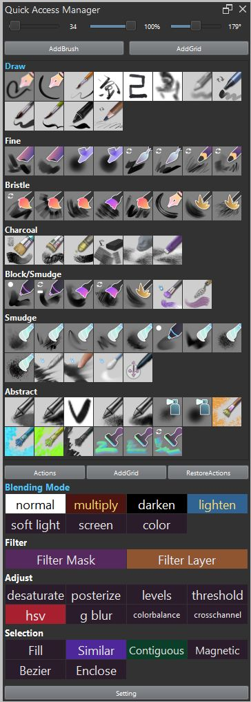
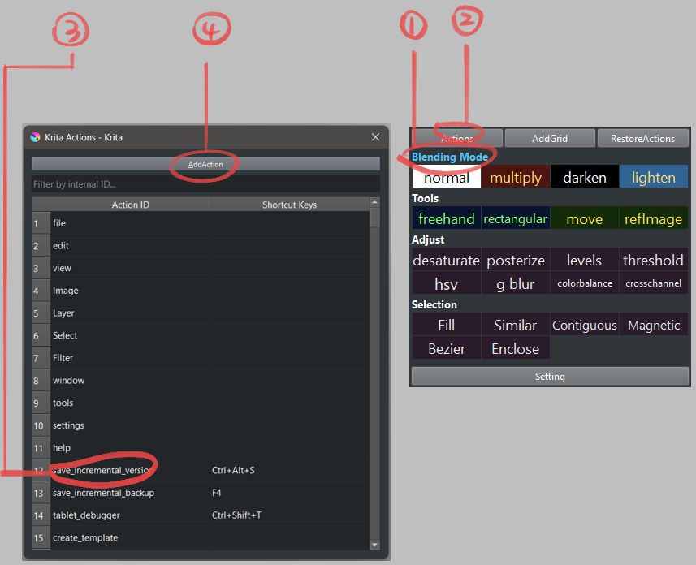
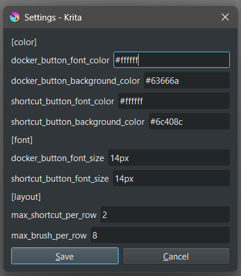
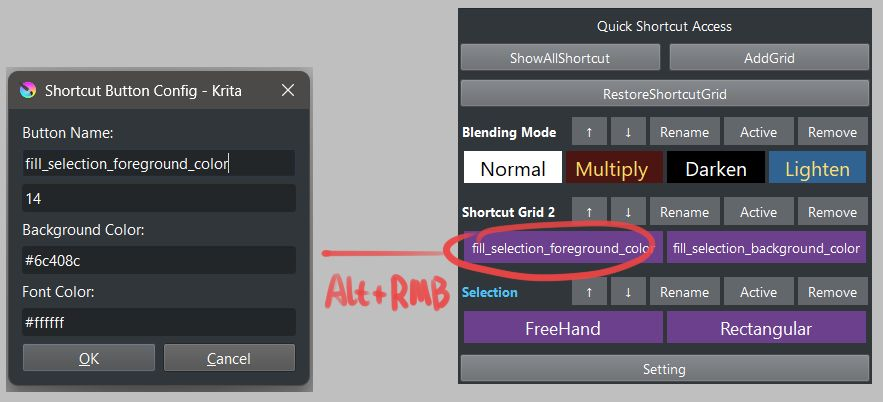

# Krita Quick Access Manager

A plugin for Krita that provides quick access to brush presets and shortcut management.

The purpose of creating this plugin was to have a function similar to the Quick Access Palette in Clip Studio Paint.

---

## How to Add a Brush Preset
1. In the "Quick Brush Access" section, activate the grid you want to add to.
2. Select the brush preset you want to add from Krita's brush preset.
3. Click the "AddBrush" button in the docker.
4. The selected preset will be added to the active grid.

## How to Add a Shortcut. 
1. In the "Quick Shortcut Access" section, activate the grid you want to add to.
2. Click the "Actions" button to open the shortcut selection popup.
3. Select the action you want to add from the table.
4. Click the "AddAction" button.
5. The selected shortcut will be added to the active grid.

 
## Global Config
Use the "Setting" button to customize the UI and layout, including the default font color, background color, and font size for shortcut buttons.

## Shortcut Button Config
To customize an individual shortcut button, hold <kbd>Alt</kbd> and right-click the button.
If you set the font size or color to a value different from the global config, that button will keep its individual settings and will not be affected by future changes to the global config.

## How the config restore works
When Krita starts, the brush preset settings will be loaded automatically.

However, the shortcut settings will not be loaded automatically because it is difficult to track the timing when Krita loads all shortcut actions.

Therefore, you need to click the [RestoreActions] button manually to restore the shortcut settings.

## Resize Docker
<del>When resizing the docker, please do it slowly.</del>

<del>If you resize too quickly, small Brush Preset popup windows may appear repeatedly, and you will need to close them manually.</del>

Since the grid update process for Brush Presets has been disabled during docker resizing, this issue should no longer occur.

## Sort/Remove

**Sort:**  
To reorder a brush or shortcut button within a grid or move it between grids, hold <kbd>Ctrl</kbd> and left-click and drag the button to the desired position or grid.

**Advanced Sort:**  
- To move a shortcut button up by one position within the same grid, hold <kbd>Shift</kbd> and left-click the grid name.
- To move a shortcut button down by one position within the same grid, hold <kbd>Shift</kbd> and right-click the grid name.
- To move a grid up by one position, hold <kbd>Shift</kbd> and left-click the grid name.
- To move a grid down by one position, hold <kbd>Shift</kbd> and right-click the grid name.

**Remove:**  
To remove a brush or shortcut from a grid, hold <kbd>Ctrl</kbd> and right-click on the button you want to remove.

**Remove Grid:**  
To delete an entire grid, hold <kbd>Ctrl</kbd> + <kbd>Alt</kbd> + <kbd>Shift</kbd> and right-click the grid name.

**Rename Grid:**  
To rename a grid, hold <kbd>Alt</kbd> and right-click the grid name.

**Activate Grid:**  
To activate a grid, simply left-click the grid name.

## Config file

The configuration files for grids and shortcuts are stored in `./quick_access_manager/config`.

- `grids_data.json`: Stores the brush preset grids.
- `shortcut_grid_data.json`: Stores the shortcut grids.
- `common.json`: Stores UI and layout settings.

**Note:**  
There is no profile management function, but you can manually edit these files while Krita is closed.  
If you want to reset or backup your settings, you can copy or edit these files directly.
