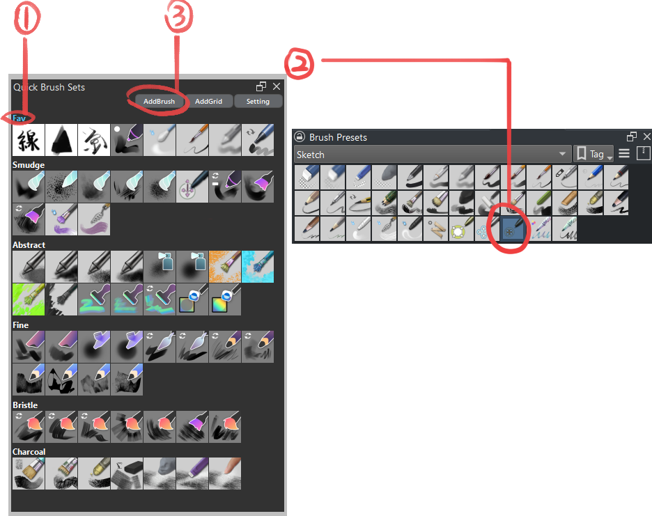
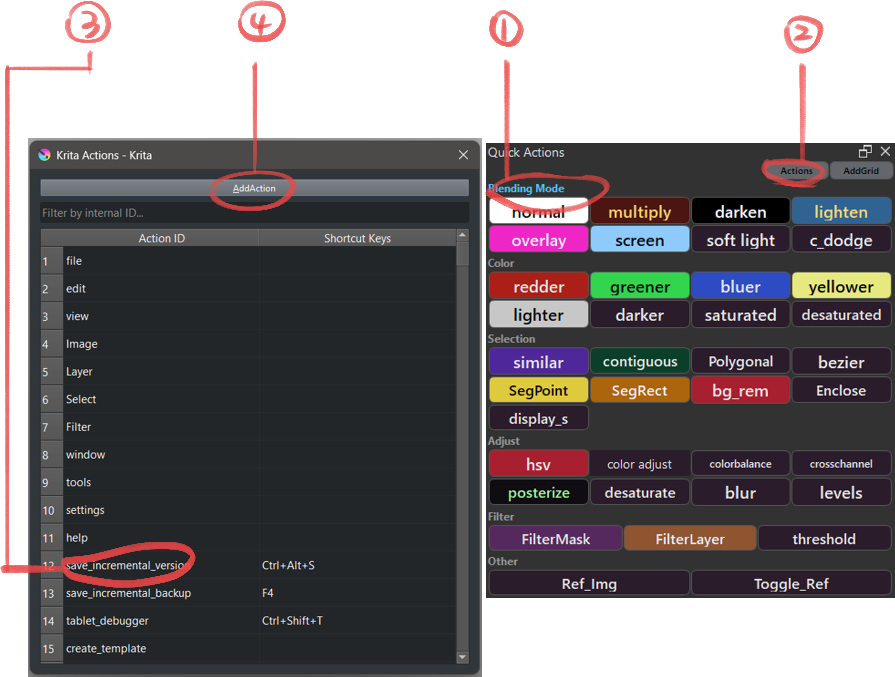
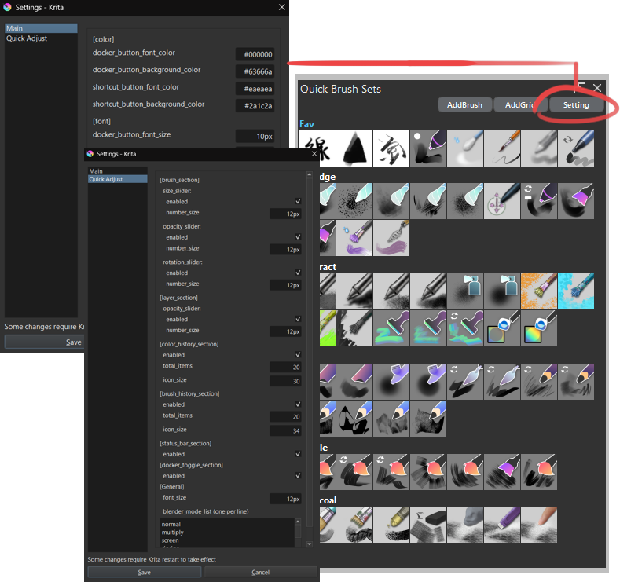

# Krita Quick Access Manager

A plugin for Krita that provides quick access to brush presets and shortcut management.

The purpose of creating this plugin was to have a function similar to the Quick Access Palette in Clip Studio Paint.


---

## Support

If you find this tool helpful, you can support its development:

[](https://ko-fi.com/toma_omito)

## How to Add a Brush Preset
1. In the "Quick Brush Sets" section, activate the grid you want to add to.
2. Select the brush preset you want to add from Krita's brush preset.
3. Click the "AddBrush" button in the docker.
4. The selected preset will be added to the active grid.


## How to Add a Shortcut. 
1. In the "Quick Actions" section, activate the grid you want to add to.
2. Click the "Actions" button to open the shortcut selection popup.
3. Select the action you want to add from the table.
4. Click the "AddAction" button.
5. The selected shortcut will be added to the active grid.

 
## Popup Window

### How to Use
1. **Brush Sets Popup**: Press `W` to show/hide the brush sets popup
2. **Actions Popup**: Press `Tab` to show/hide the actions popup

### Change Shortcut and icon/button size
Edit the following value to change shortcut key and icon/button size:
- `quick_access_manager\popup\brush_sets.py`
    - `BrushSetsPopupShortcut`
    - `BrushIconSize`
- `quick_access_manager\popup\actions.py`
    - `ActionsPopupShortcut`
    - `ActionButtonSizeX`
    - `ActionButtonSizeY`

## Global Config
Use the "Setting" button to customize the UI and layout, including the default font color, background color, and font size for shortcut buttons.


## Shortcut Button Config
To customize an individual shortcut button, hold <kbd>Alt</kbd> and right-click the button.
If the "Use Global Settings" is checked, the color of font and background will use the value in the global config file.


## Sort/Remove

**Sort:**  
To reorder a brush or shortcut button within a grid or move it between grids, hold <kbd>Ctrl</kbd> and left-click and drag the button to the desired position or grid.

**Advanced Sort:**  
- To move a shortcut button up by one position within the same grid, hold <kbd>Shift</kbd> and left-click the grid name.
- To move a shortcut button down by one position within the same grid, hold <kbd>Shift</kbd> and right-click the grid name.
- To move a grid up by one position, hold <kbd>Shift</kbd> and left-click the grid name.
- To move a grid down by one position, hold <kbd>Shift</kbd> and right-click the grid name.

**Remove:**  
To remove a brush or shortcut from a grid, hold <kbd>Ctrl</kbd> and right-click on the button you want to remove.

**Remove Grid:**  
To delete an entire grid, hold <kbd>Ctrl</kbd> + <kbd>Alt</kbd> + <kbd>Shift</kbd> and right-click the grid name.

**Rename Grid:**  
To rename a grid, hold <kbd>Alt</kbd> and right-click the grid name.

**Activate Grid:**  
To activate a grid, simply left-click the grid name.

## Config file

The configuration files for grids and shortcuts are stored in `./quick_access_manager/config`.

- `grids_data.json`: Stores the brush preset grids.
- `shortcut_grid_data.json`: Stores the shortcut grids.
- `common.json`: Stores UI and layout settings.

**Note:**  
There is no profile management function, but you can manually edit these files while Krita is closed.  
If you want to reset or backup your settings, you can copy or edit these files directly.

## Quick Brush Adjustments Docker


A dedicated docker for quick brush and layer adjustments, providing instant access to commonly used painting settings.

### Features

**Brush Controls:**
- **Size Slider**: Adjusts brush size from 1 to 1000 pixels with non-linear scaling for precise control of small brushes
- **Opacity Slider**: Controls brush opacity (0-100%)
- **Rotation Widget**: Circular dial for intuitive brush rotation adjustment (0-360°)
- **Blend Mode Dropdown**: Quick access to change the current brush's blending mode
- **Reset Button**: Instantly reloads the current brush preset to its default settings

**Layer Controls:**
- **Layer Opacity Slider**: Adjusts the active layer's opacity (0-100%)
- **Layer Blend Mode Dropdown**: Change the active layer's blending mode

**Color & Brush History:**
- **Color History**: Quick access to recently used colors
- **Brush History**: Switch between recently used brush presets

### Docker Toggle Buttons
The buttons at the bottom of the docker provide quick show/hide toggles for other Krita dockers (e.g., Tool Options, Layers, Brush Presets).

**Configuration:**
- Settings are stored in `quick_access_manager\config\docker_buttons.json`
- The file is auto-created with default buttons on first launch if it doesn't exist
- To use custom icons, place PNG files in `quick_access_manager\config\icon` (24×24px recommended)

**Button Configuration Format:**
```json
{
  "button_name": "Display Name",
  "button_width": 50,
  "button_icon": "filename.png",
  "docker_keywords": ["keyword1", "keyword2"],
  "description": "Tooltip text"
}
```

### Customization
To modify the docker's appearance and behavior, edit the parameters in:
- `quick_access_manager\quick_brush_adjust_widgets\__init__.py`

Available customization options:
- Font sizes for labels and values
- Number of color/brush history items
- Icon sizes for history widgets
- Available blend modes in dropdowns
