# Krita Quick Access Manager

A plugin for Krita that provides quick access to brush presets and shortcut management.

## Features

- **Quick Brush Sets**: Organize and access your favorite brush presets in customizable grids with popup window support for quick switching
- **Quick Actions**: Create custom shortcut buttons for any Krita action with popup window for instant access
- **Gesture System**: Execute actions using keyboard + mouse directional gestures with visual preview overlay
- **Quick Brush Adjust Docker**: Dedicated docker with brush/layer controls, color/brush history, and real-time status indicators

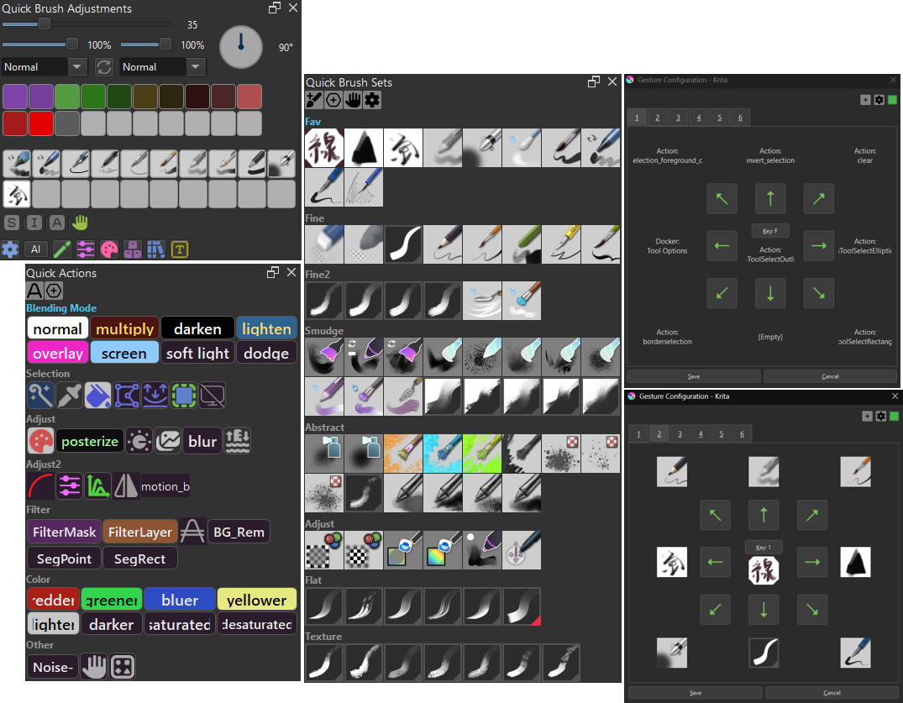
---

## Support

If you find this tool helpful, you can support its development:

[](https://ko-fi.com/toma_omito)

## Table of Contents
- [How to Add a Brush Preset](#how-to-add-a-brush-preset)
- [How to Add a Shortcut](#how-to-add-a-shortcut)
- [Popup Window](#popup-window)
- [Gesture System](#gesture-system)
  - [Features](#features)
  - [How to Use](#how-to-use)
  - [Temporarily Disable](#temporarily-disable)
  - [Preview](#preview)
  - [Alias](#alias)
  - [External API](#external-api)
- [Quick Brush Adjustments Docker](#quick-brush-adjustments-docker)
  - [Floating Widget](#floating-widget)
- [Global Config](#global-config)
- [Shortcut Button Config](#shortcut-button-config)
- [Sort/Remove](#sortremove)

## How to Add a Brush Preset
1. In the "Quick Brush Sets" section, activate the grid you want to add to.
2. Select the brush preset you want to add from Krita's brush preset.
3. Click the "AddBrush" button in the docker.
4. The selected preset will be added to the active grid.
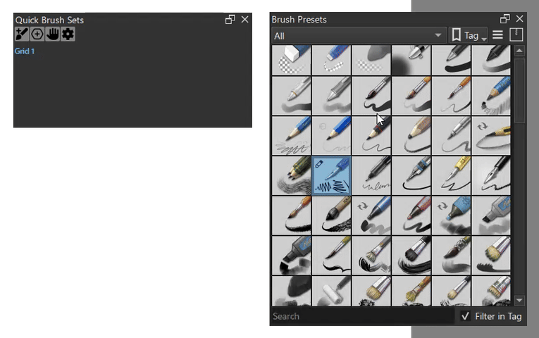

## How to Add a Shortcut. 
1. In the "Quick Actions" section, activate the grid you want to add to.
2. Click the "Actions" button to open the shortcut selection popup.
3. Select the action you want to add from the table.
4. Click the "AddAction" button.
5. The selected shortcut will be added to the active grid.
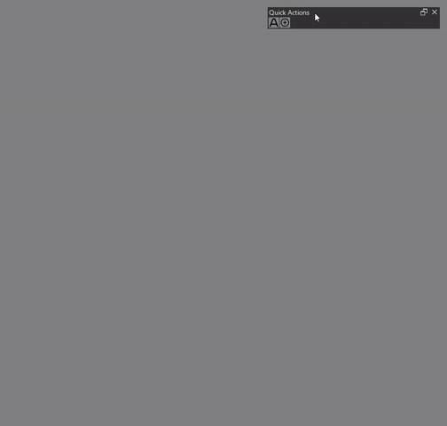
 
## Popup Window
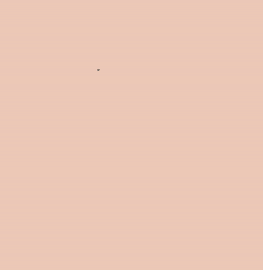
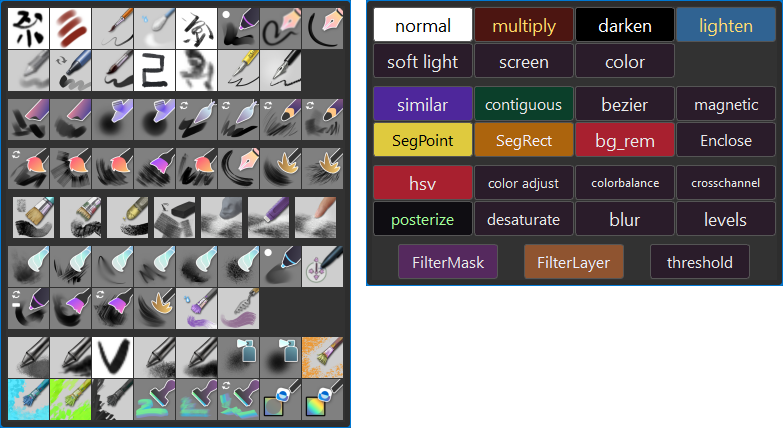

### How to change shortcut and icon size
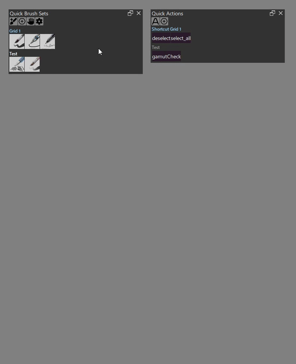

**The default key for both popup are `W` and `Tab`.**

**Krita uses `Tab` for `Show canvas only` action, so you need to remove the shortcut first.**

## Gesture System
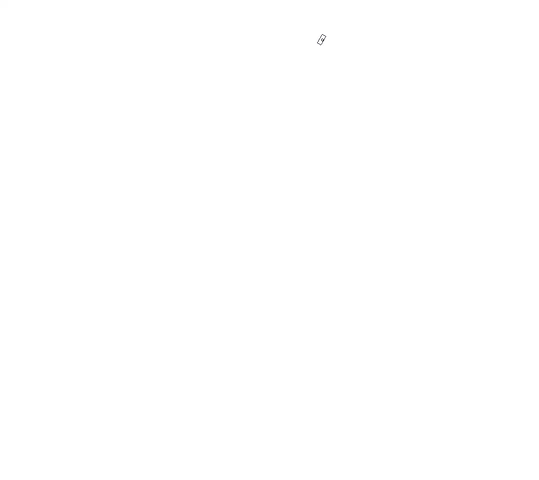
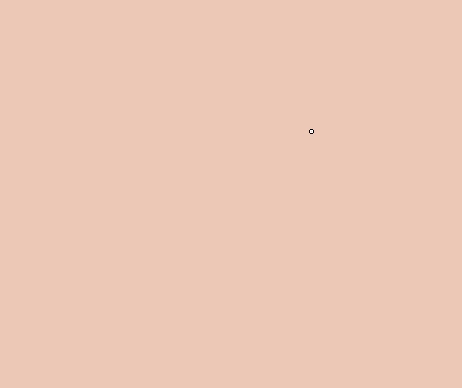
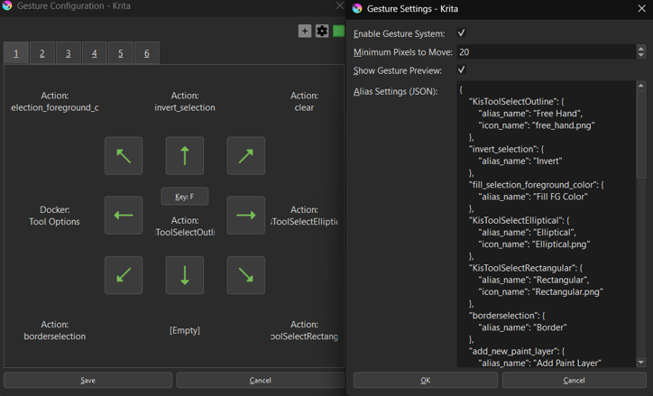

A gesture-based control system that allows you to trigger actions using keyboard + mouse movements.

### Features
- **9-Directional Gestures**: Execute different actions based on 8 directional swipes  plus a center tap action
- **Multiple Gesture Pages**: Each with its own trigger key
- **Gesture Actions**: Support for brush presets, actions, and docker visibility toggles
- **Customizable Sensitivity**: Adjust the minimum pixel movement required to trigger gestures
- **Visual Configuration**: Intuitive UI with arrow icons and action previews

### How to Use
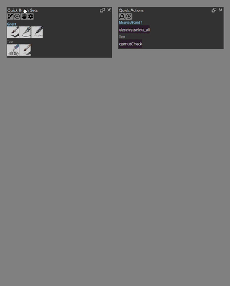
> **First-time setup**: When opening the gesture configuration dialog for the first time, you may see an empty "1" tab. Ignore it and simply click the "+" button to create your first gesture page.

1. **Open Configuration**: Click the "Gesture" button in the Quick Access Manager docker to open the gesture configuration dialog

2. **Configure Trigger Key**: 
   - Click the center "Config Key" button
   - Press any key (A-Z, 0-9, F1-F12, etc.) to assign it as the gesture trigger
   - Configure the center tap action (executed when you press and release the key without moving)
   - **Important**: If the key is already assigned to a Krita shortcut, you must remove it first, as Krita's native shortcuts take priority

3. **Configure Directional Gestures**:
   - Click any arrow button to configure an action for that direction
   - Choose from:
     - **Brush Preset**: Select the currently active brush
     - **Action**: Choose any Krita action from the list
     - **Docker Toggle**: Show/hide a specific docker by name
     - **None**: Clear the gesture configuration

4. **Add More Gesture Pages**:
   - Click the "+" button to create additional gesture configurations
   - Each page can have its own trigger key and 9 actions

5. **Settings**:
   - Click the "Settings" button to access:
     - **Enable Gesture System**: Toggle the entire gesture system on/off (Require Krita restart)
     - **Minimum Pixels to Move**: Adjust gesture sensitivity (1-200 pixels)
     - **Preview Overlay**: Enable/Disable preview overlay

6. **Execute Gestures**:
   - Press and hold the configured trigger key
   - Move(hover) your mouse in one of the 8 directions
   - Release the key to execute the action
   - Or simply press and release without moving to trigger the center action

### Temporarily Disable
There is a Krita shortcut `Toggle Gesture Recognition` that can be used to disable gesture recognition temporarily.


### Preview Overlay
By default, a visual preview overlay appears when you press and hold the gesture key, showing all configured actions for each direction. 
You can disable the preview overlay in the gesture settings.

#### Tips
- The dialog is modeless, allowing you to continue working in Krita while it's open
- Gesture detection is automatically disabled while the configuration dialog is active
- All configurations are saved automatically when you click "Save"
- Configuration files are stored in `quick_access_manager\gesture\config\`

#### Alias


You can rename actions and add custom icons to the gesture preview overlay.

**How to set up aliases:**
1. Open the gesture config dialog
2. Click the "Settings" button in the top-right corner
3. Edit the "Alias Settings (JSON)" field

**Example:**
```json
{
    "KisToolSelectOutline": {
        "alias_name": "Free Hand",
        "icon_name": "free_hand.png"
    },
    "invert_selection": {
        "alias_name": "Invert"
    },
    "Tool Options": {
        "icon_name": "tool_option.png"
    }
}
```

- `alias_name`: Custom name to show instead of the action ID
- `icon_name`: PNG file name from `quick_access_manager\gesture\icon\` folder
- Both fields are optional
- Priority: Icon > Alias Name > Original Name

### External API

The gesture system provides a public API for external plugins to pause and resume gesture detection when needed:

```python
from quick_access_manager.gesture.gesture_main import (
    pause_gesture_event_filter,
    resume_gesture_event_filter,
    is_gesture_filter_paused
)

# Pause gesture detection (completely removes event filter)
pause_gesture_event_filter()

# Resume gesture detection (reinstalls event filter)
resume_gesture_event_filter()

# Check if gesture filter is currently paused
if is_gesture_filter_paused():
    print("Gesture detection is paused")
```

**Use Cases:**
- Pause gestures during heavy document operations to prevent UI freezing
- Disable gestures when other plugins need exclusive keyboard/mouse control
- Temporarily suspend gesture detection during critical operations

**Example:**
```python
try:
    pause_gesture_event_filter()
    # Perform heavy operations (e.g., document loading, batch processing)
    open_document(file_path)
finally:
    # Always resume in finally block to ensure gestures are re-enabled
    resume_gesture_event_filter()
```

**Technical Details:**
- `pause_gesture_event_filter()`: Calls `QApplication.removeEventFilter()` for zero overhead when paused
- `resume_gesture_event_filter()`: Calls `QApplication.installEventFilter()` to restore gesture detection
- When paused, the event filter is completely removed from Qt's event chain, eliminating all processing overhead

## Quick Brush Adjustments Docker


A dedicated docker for quick brush and layer adjustments, providing instant access to commonly used painting settings. 
The docker also includes a control bar at the right side that has toggle button for floating `Tool Options` Docker and brush rotation widget.
It also displays real-time indicators for active selection and gesture system states. Click the gesture icon will toggle on/off the gesture system.

### Features

**Brush Controls:**
- **Size Slider**: Adjusts brush size from 1 to 1000 pixels with non-linear scaling for precise control of small brushes
- **Opacity Slider**: Controls brush opacity (0-100%)
- **Rotation Widget**: Circular dial for intuitive brush rotation adjustment (0-360°)
- **Blend Mode Dropdown**: Quick access to change the current brush's blending mode
- **Reset Button**: Instantly reloads the current brush preset to its default settings

**Layer Controls:**
- **Layer Opacity Slider**: Adjusts the active layer's opacity (0-100%)
- **Layer Blend Mode Dropdown**: Change the active layer's blending mode

**Color & Brush History:**
- **Color History**: Quick access to recently used colors
- **Brush History**: Switch between recently used brush presets

### Docker Toggle Buttons
The buttons at the bottom of the docker provide quick show/hide toggles for other Krita dockers (e.g., Tool Options, Layers, Brush Presets).

**Configuration via Settings UI:**


1. Click the "Setting" button in the docker
2. Go to the "Quick Adjust" tab
3. Scroll down to the "[Docker Toggle Buttons]" section
4. Use the "Add Button" button to create new docker toggles
5. Configure each button's properties:
   - **Button Name**: Display text on the button
   - **Button Width**: Width in pixels
   - **Button Icon**: Optional PNG filename from `quick_access_manager\config\icon\` (24×24px recommended)
   - **Docker Keywords**: Comma-separated keywords to match docker names (e.g., "tool, option" matches "Tool Options")
   - **Description**: Tooltip text shown on hover
6. Click "Remove This Button" to delete unwanted buttons
7. Click "Save" to apply changes

**Configuration File:**
- Settings are stored in `quick_access_manager\config\docker_buttons.json`
- The file is auto-created with default buttons on first launch if it doesn't exist
- You can manually edit the JSON file if preferred

**Button Configuration Format:**
```json
{
  "button_name": "Display Name",
  "button_width": 50,
  "button_icon": "filename.png",
  "docker_keywords": ["keyword1", "keyword2"],
  "description": "Tooltip text"
}
```

### Floating Widget
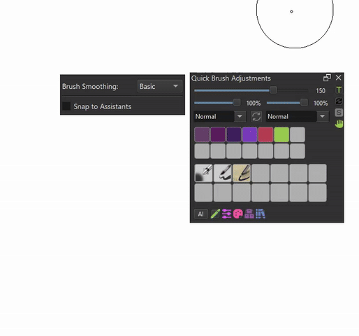

The Quick Brush Adjust docker includes a companion floating Tool Options widget that can be positioned relative to the docker.

**Features:**
- Automatically positions itself to the left of the Quick Brush Adjust docker
- Follows the docker when moved

**Configuration:**
The floating widget behavior can be customized in the Settings dialog under "Quick Adjust" tab:
- **enabled**: Enable/disable the floating Tool Options widget
- **start_visible**: Set whether the widget appears automatically on startup

**Credits:**
The floating widget system is based on the work from [Krita-UI-Redesign](https://github.com/veryprofessionaldodo/Krita-UI-Redesign) by veryprofessionaldodo.

### Customization
To modify the docker's appearance and behavior, see "Global Config".

## Global Config
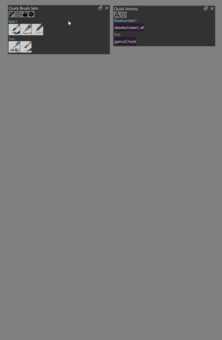

The global configuration allows you to customize the default appearance and behavior for all shortcut buttons and UI elements.

**How to Access:**
- Click the "Setting" button in the docker

**Available Settings:**
- **Default Font Color**: Sets the default text color for shortcut buttons
- **Default Background Color**: Sets the default background color for shortcut buttons
- **Default Font Size**: Sets the default text size for shortcut buttons
- **Max Shortcut Per Row**: Controls how many buttons appear in each row (default: 4)
- **Spacing Between Buttons/Grids**: Adjusts the spacing between UI elements
- **Quick Brush Adjustments Docker Settings**: Customize font sizes, history sizes, and other docker-specific options

**Note:** Individual buttons can override these global settings. See "Shortcut Button Config" below.

## Shortcut Button Config
Each shortcut button can be individually customized with its own appearance settings.
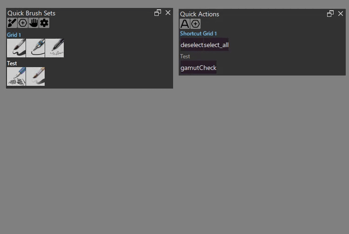

**How to Access:**
- Hold <kbd>Alt</kbd> and right-click any shortcut button
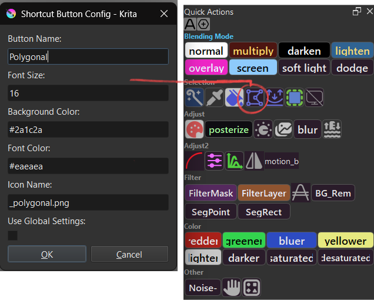

**Available Options:**
- **Button Name**: Custom display name for the button
- **Font Size**: Override the global font size for this button
- **Background Color**: Custom background color (hex color code, e.g., `#3d3d3d`)
- **Font Color**: Custom text color (hex color code, e.g., `#ffffff`)
- **Icon Name**: PNG filename to display as an icon instead of text
- **Use Global Settings**: When checked, the button uses colors from the global config


**Icon Support:**
To display a button as an icon instead of text:
1. Place your PNG icon file in `quick_access_manager\config\icon\`
2. Open the button config dialog (<kbd>Alt</kbd> + right-click)
3. Enter the filename in the "Icon Name" field (e.g., `my_icon.png`)
4. Configure the grid's "Icon Size" parameter (see "Edit Grid Parameter" below)
5. When both icon name and grid icon size are set, the icon will be displayed


**Tips:**
- Leave "Icon Name" empty to display text instead
- Icons automatically replace text when configured

## Sort/Remove

**Sort:**  
To reorder a brush or shortcut button within a grid or move it between grids, hold <kbd>Ctrl</kbd> and left-click and drag the button to the desired position or grid.

**Advanced Sort:**  
- To move a shortcut button up by one position within the same grid, hold <kbd>Shift</kbd> and left-click the grid name.
- To move a shortcut button down by one position within the same grid, hold <kbd>Shift</kbd> and right-click the grid name.
- To move a grid up by one position, hold <kbd>Shift</kbd> and left-click the grid name.
- To move a grid down by one position, hold <kbd>Shift</kbd> and right-click the grid name.

**Remove:**  
To remove a brush or shortcut from a grid, hold <kbd>Ctrl</kbd> and right-click on the button you want to remove.

**Remove Grid:**  
To delete an entire grid, hold <kbd>Ctrl</kbd> + <kbd>Alt</kbd> + <kbd>Shift</kbd> and right-click the grid name.

**Edit Grid Parameter:**
Each grid can have its own configuration parameters that override global settings.

**How to Access:**
- Hold <kbd>Alt</kbd> and right-click the grid name

**Available Parameters:**
- **Grid Name**: Rename the grid to organize your shortcuts
- **Max Shortcut Per Row**: Set a grid-specific column count (overrides global setting)
  - Leave empty to use the global "Max Shortcut Per Row" setting
  - Set a number (e.g., `6`) to use a custom column count for this grid only
- **Icon Size**: Set the size for icon buttons in this grid (in pixels)
  - Required for buttons with icons to display properly
  - Leave empty for text-only grids
  - Recommended value: `24` (pixels)
  - Buttons with `icon_name` configured will only display icons if this is set

**Activate Grid:**  
To activate a grid, simply left-click the grid name.

