# Krita Quick Access Manager

Krita Quick Access Manager is a Krita Python plugin focused on quickly accessing
various Krita resources by arranging them all in one place.
The original concept was to bring Clip Studio Paint's Quick Access palette to Krita.

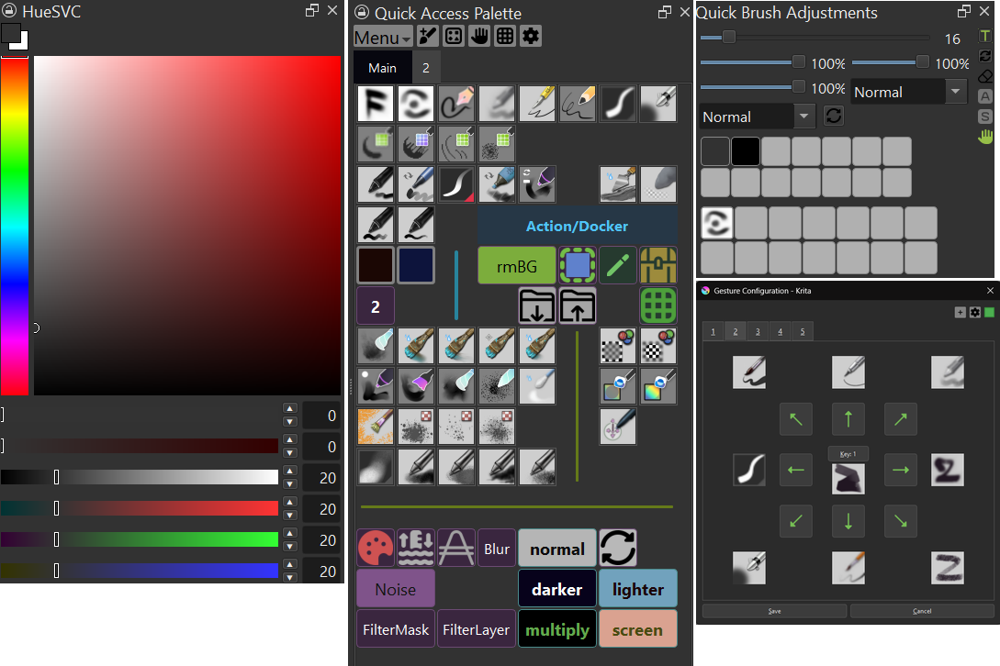


## Table of Contents

- [Quick Access Palette](#quick-access-palette)
  - [Palette Item Types](#palette-item-types)
  - [Resources And Aliases](#resources-and-aliases)
  - [Manage Item Property](#manage-item-property)
  - [Move Item](#move-item)
  - [Grid Edit](#grid-edit)
  - [Popup](#popup)
- [Gesture System](#gesture-system)
  - [Features](#features)
  - [How to Use](#how-to-use)
  - [Temporarily Disable](#temporarily-disable)
  - [Preview Overlay](#preview-overlay)
- [Quick Brush Adjustments Docker](#quick-brush-adjustments-docker)
  - [Features](#features-1)
  - [Temp Action Mode](#temp-action-mode)
  - [Temp Brush Sets](#temp-brush-sets)
  - [Floating Widget](#floating-widget)
  - [Move To Cursor](#move-to-cursor)
- [HueSVC](#huesvc)
- [Settings](#settings)
- [Config Files](#config-files)

## Quick Access Palette

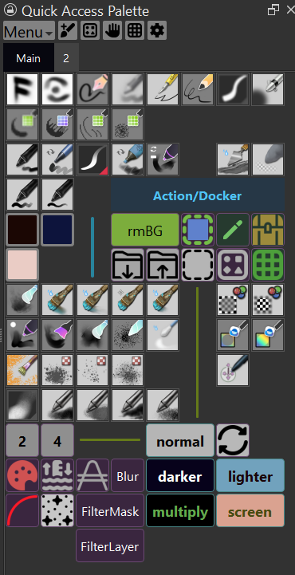

The Quick Access Palette is the main docker used to manage quick access to
supported Krita resources and settings.

### Palette Item Types

The following item types are supported:

| Item Type | Purpose | Size Behavior |
| --- | --- | --- |
| Brush | Switch to a brush preset | Fixed 1x1 |
| Action | Run a Krita action | Text mode defaults to 2x1 and is resizable; icon mode is fixed 1x1 |
| Docker Toggle | Show/hide a Krita docker | Text mode defaults to 2x1 and is resizable; icon mode is fixed 1x1 |
| Color | Set foreground color | Fixed 1x1 |
| Brush Size | Set the active brush size | Fixed 1x1 |
| Brush Blend Mode | Set the active brush blend mode | Fixed 2x1 |
| Script | Execute a Python script | Text mode defaults to 2x1 and is resizable; icon mode is fixed 1x1 |
| Label | Display custom text | Resizable width |
| Separator | Horizontal or vertical separator | Resizable on its orientation axis |

### Resources And Aliases

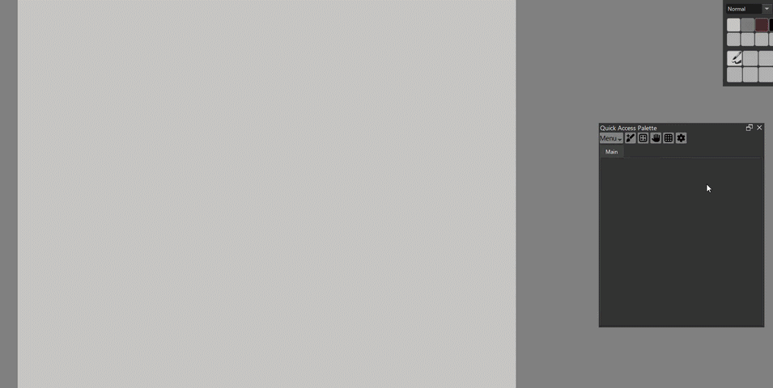

To add a Brush, Action, or Docker Toggle item, click the **Resources** button
to open the Resources dialog. From there, pick a brush/action/docker and click
**Add** to place it on the palette.

For brushes, you can select multiple presets and add them all at once. You can
also use **Add Brush** in the header menu to add the currently active brush
preset directly.

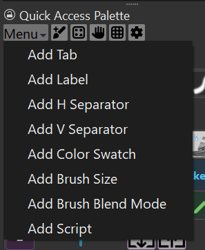

Every other item type (Label, Separator, Color, Script, Brush Size, Brush
Blend Mode) is added from the header **Menu** button instead.

The Resources dialog also manages **aliases**: a custom display name, icon,
and color for a given Krita action or docker. Aliases are shared, so setting
one updates every Action/Docker Toggle item — and every Gesture binding — that
references that action or docker.

### Manage Item Property

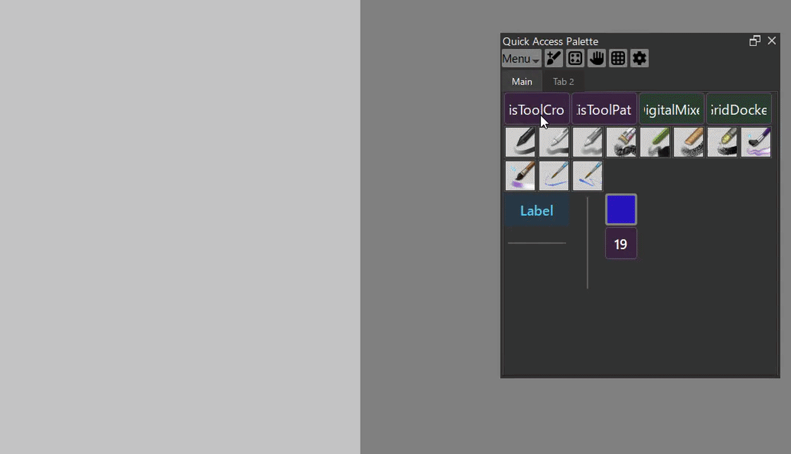

Most item properties can be edited by right-clicking the item and choosing
**Property**. This opens a dialog where you can change the text, color, or
icon, depending on the item type.

For Action and Docker Toggle items, you can also edit these properties from
the Resources dialog, which updates the shared alias everywhere it's used.

### Move Item

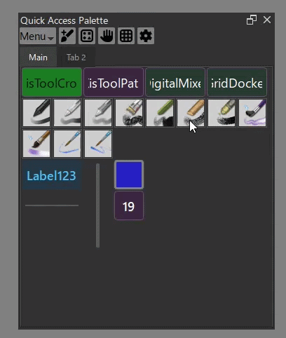

Ctrl + left-drag moves a single item within the grid. You can remove an item
via its right-click menu, or drop it onto another item to push that item
aside and take its place. For multi-item selection, cross-tab moves, or
resizing, use Grid Edit.

### Grid Edit

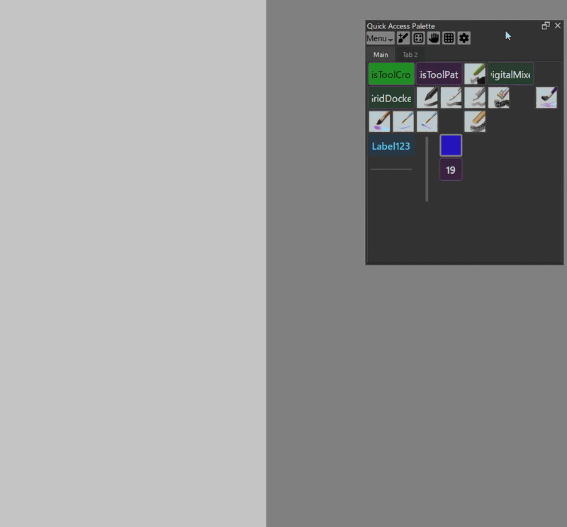

Click **Grid Edit** to open the Grid Edit dialog, where you can:

- Select multiple items and move them together
- Select multiple items and copy/move them to another tab
- Resize text-mode items by dragging their edge
- Undo an accidental move or resize with the Undo button

### Popup

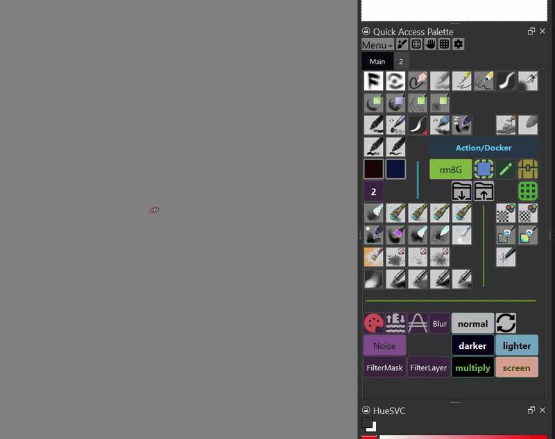

The Quick Access Palette can also open as a popup at the cursor position via
its shortcut. The popup shares the same tabs and items as the docker but is
execution-only — layout editing is only available in the docker.

The docker itself also supports **[Move to Cursor](https://github.com/Aqaao/DockerUnderCursor)**, which floats it and
centers it on the cursor (or re-docks it if it's already floating), letting
you reposition it without leaving the canvas.


## Gesture System
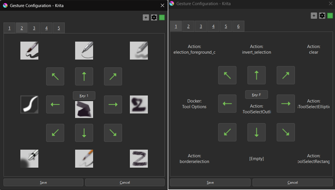
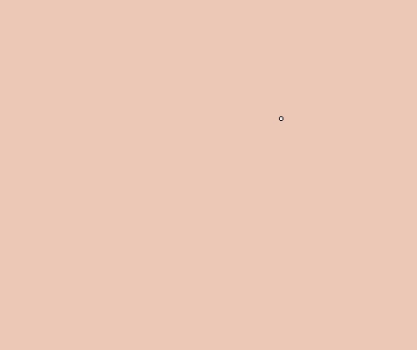
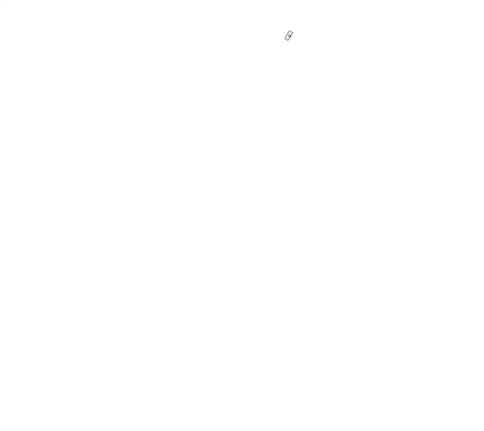

A gesture-based control system that lets you trigger actions with keyboard + mouse movement.

### Features
- **9-Directional Gestures**: run a different action for each of 8 directional swipes, plus a center-tap action
- **Multiple Gesture Pages**: each page has its own trigger key
- **Gesture Actions**: brush presets, Krita actions, and docker visibility toggles are all supported
- **Customizable Sensitivity**: adjust the minimum pixel movement required to trigger a gesture
- **Visual Configuration**: an intuitive UI with arrow icons and action previews

### How to Use

> **First-time setup**: When opening the gesture configuration dialog for the first time, you may see an empty "1" tab. Ignore it and simply click the "+" button to create your first gesture page.

1. **Open Configuration**: Click the "Gesture" button in the Quick Access Palette docker to open the gesture configuration dialog

2. **Configure Trigger Key**:
   - Click the center "Config Key" button
   - Press any key (A-Z, 0-9, F1-F12, etc.) to assign it as the gesture trigger
   - Configure the center-tap action (executed when you press and release the key without moving)
   - **Important**: if the key is already assigned to a Krita shortcut, remove that shortcut first — Krita's native shortcuts take priority

3. **Configure Directional Gestures**:
   - Click any arrow button to configure an action for that direction
   - Choose from:
     - **Brush Preset**: Select the currently active brush
     - **Action**: Choose any Krita action from the list
     - **Docker Toggle**: Show/hide a specific docker by name
     - **None**: Clear the gesture configuration

4. **Add More Gesture Pages**:
   - Click the "+" button to create additional gesture configurations
   - Each page can have its own trigger key and 9 actions

5. **Settings**:
   - Click the "Settings" button to access:
     - **Enable Gesture System**: toggle the entire gesture system on/off (requires a Krita restart)
     - **Minimum Pixels to Move**: adjust gesture sensitivity (1-200 pixels)
     - **Preview Overlay**: enable/disable the preview overlay

6. **Execute Gestures**:
   - Press and hold the configured trigger key
   - Move (hover) your mouse in one of the 8 directions
   - Release the key to execute the action
   - Or simply press and release without moving to trigger the center action

### Temporarily Disable
The Krita shortcut `Toggle Gesture Recognition` disables gesture recognition temporarily without turning off the whole system.

### Preview Overlay

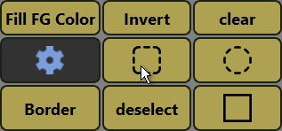

By default, a visual preview overlay appears when you press and hold the gesture key, showing every configured action for each direction.
You can disable the preview overlay in the gesture settings.

## Quick Brush Adjustments Docker
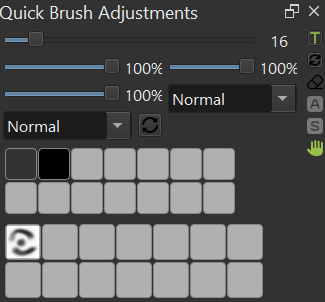

A dedicated docker for quick brush and layer adjustments, giving instant access to commonly used painting settings.
A control bar on the right side holds toggle buttons for the floating widgets, plus real-time indicators for the
active-selection and gesture-system states — clicking the gesture icon toggles the gesture system on/off.
Each slider can be individually enabled or disabled from Settings.

### Features

**Brush Controls:**
- **Size Slider**: Adjusts brush size from 1 to 1000 pixels with non-linear scaling for precise control of small brushes
- **Opacity Slider**: Controls brush opacity (0-100%)
- **Flow Slider**: Controls brush flow (0-100%)
- **Rotation Widget**: Circular dial for intuitive brush rotation adjustment (0-360°)
- **Blend Mode Dropdown**: Quick access to change the current brush's blending mode
- **Reset Button**: Instantly reloads the current brush preset to its default settings

**Layer Controls:**
- **Layer Opacity Slider**: Adjusts the active layer's opacity (0-100%)
- **Layer Blend Mode Dropdown**: Change the active layer's blending mode

**Color & Brush History:**
- **Color History**: Quick access to recently used colors
- **Brush History**: Switch between recently used brush presets

**Control Bar**
- **Toggle Widget Visibility**: show/hide the floating widgets
- **Toggle Brush Preserve Alpha**: enable/disable the `Preserve Alpha` setting
- **Active Selection Status**: turns green when there's an active selection
- **Toggle Gesture System**: pause/resume the gesture system

### Temp Action Mode
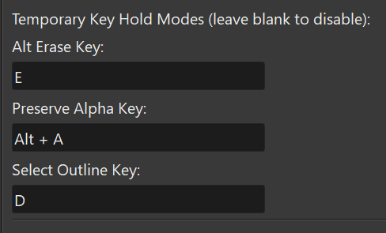
Hold a configurable key to temporarily activate an action; releasing the key restores the original state. All keys are empty (disabled) by default and can be set via Settings → Quick Adjust tab (requires a Krita restart to take effect).

- **Temp Erase**: hold the key to temporarily activate Krita's erase mode. Configure under *[Alt Erase]*.
- **Temp Preserve Alpha**: hold the key to temporarily enable Krita's Preserve Alpha mode. Configure under *[Preserve Alpha]*.
- **Temp Freehand Selection**: hold the key to switch to the Freehand Selection tool; release to return to the Brush tool. Configure under *[Temp Freehand Selection]*.

### Temp Brush Sets
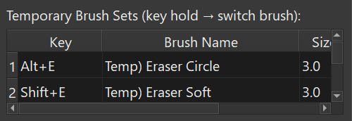

Hold a key (or key combo) to temporarily switch to a configured brush preset; release to restore the original brush.

**Configuration via Settings UI:**
1. Click the "Settings" button in the docker
2. Go to the "Quick Adjust" tab
3. Scroll down to the "[Temp Brush Set]" section
4. Click "Add Row" to create a new entry
5. Configure each entry:
   - **Hold Key**: key or combo to trigger the swap (e.g. `Alt+1`, `Ctrl+F1`, `F5`)
   - **Brush**: name of the target brush preset
   - **Size Scale**: float multiplier applied to your current brush size when switching (`0` = no size change, `0.5` = half size, `2.0` = double size)
6. Click "Remove" to delete an entry
7. Click "Save" to apply changes (takes effect after restarting the plugin)

**Multiple entries** are supported — add as many key/brush pairs as you need.

### Floating Widget
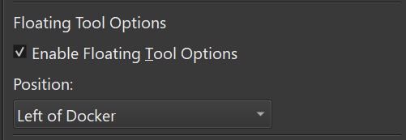

The Quick Brush Adjustments docker includes companion floating widgets that can be positioned relative to the docker.
Currently supported widgets:
- Tool Options docker (positioned left, right, or bottom)
- Brush Rotation widget (positioned top, aligned right)

To float the Tool Options widget, set `Tool Options Location` to `In Docker`.

**Features:**
- Positioned relative to the docker per the configured location setting
- Follows the docker when it's moved

### Move To Cursor

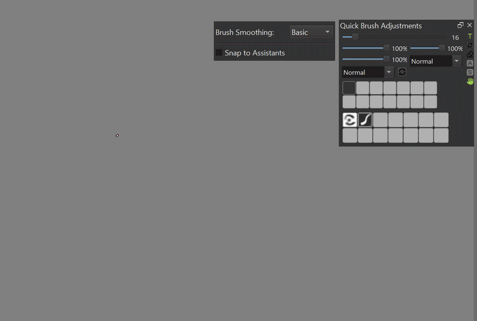

The docker itself also supports **Move To Cursor**, which floats it and
centers it on the cursor (or re-docks it if it's already floating), letting
you reposition it without leaving the canvas.

## HueSVC
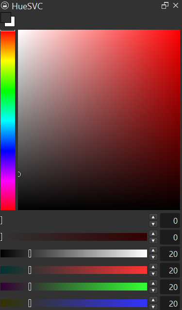

A compact color selector docker with a vertical hue bar, a saturation/value box, and 6 individual channel bars for H, S, V, R, G, B.

**Features:**
- **FG/BG color swatch** — two stacked squares at the top display the current foreground (front) and background (back) colors; click either to swap them instantly
- Drag any channel bar to adjust its value; the color is applied to Krita after a short debounce delay
- Use the ▲/▼ buttons, or type a number directly into a channel's value field, for precise control
- Syncs automatically with Krita's active foreground and background colors at a configurable interval
- Available as a **popup window** — press the configured shortcut key to open it at the cursor; the popup closes when the mouse leaves it

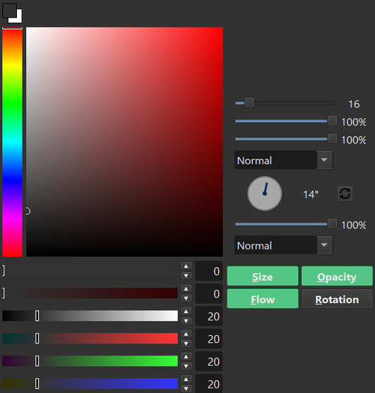

The HueSVC popup also bundles the sliders and dropdowns from the Quick Brush Adjustments docker into a panel on the right side, plus a brush pressure-sensitivity toggle panel below it.


## Settings
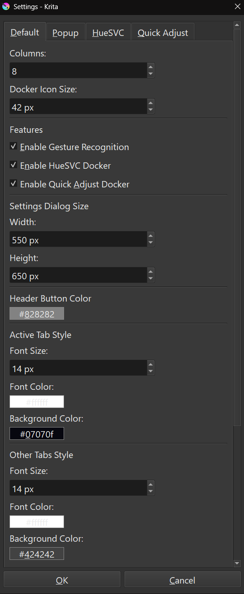

If the optional Gesture, HueSVC, or Quick Adjust features affect Krita's performance, you can disable each of them from the Settings dialog.

## Config Files

User configuration is stored outside `pykrita`, under Krita's data folder:

```text
krita/
|- pykrita/
|  |- quick_access_manager/
|  `- quick_access_manager.desktop
`- quick_access_manager/
   `- remaster/
      |- quick_access_palette.json
      |- settings.json
      |- alias_config.json
      `- gesture/
         |- gesture.json
         `- config/
```

